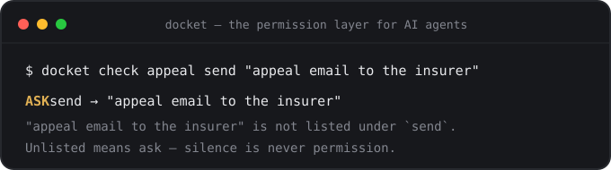

<div align="center">

# docket

**AI 智能体的权限层——和它的书面凭证。**

[](https://www.npmjs.com/package/docket-agent)
[](https://github.com/shahcolate/docket/actions)
[](package.json)
[](package.json)
[](LICENSE)

[English](README.md) · **简体中文**



智能体行动之前，先核对你写下的一页规则文件：允许（allow）、询问（ask）、
还是拒绝（deny）。行动之后，留下一份防篡改的记录。凡是你没有写下的，
智能体必须先问。规则就是仓库里的纯 Markdown 文件；兼容 Claude、
ChatGPT/Codex、Gemini、Cursor、OpenClaw、Hermes 以及任何 MCP 客户端。

**安装：** `npm install -g docket-agent` · **文档：**
[shahcolate.github.io/docket/docs.html](https://shahcolate.github.io/docket/docs.html)

零依赖 · 纯 Markdown + JSONL · MIT

</div>

---

## 最新动态

- **2026.07** — `v0.3.0` 推出 **`docket hook`**：把授权令变成 Claude Code 的 PreToolUse 门禁——allow/ask/deny 由执行框架强制执行，而不是靠提示词。同时规范新增“延迟后果”规则，红队套件新增**定时逃逸**场景族。
- **2026.07** — `v0.2.1` 发布至 npm：软件包内附带最新的 README 与 CLI 帮助。
- **2026.07** — `v0.2.0` 推出 **`docket review`**：记录会自动提议授权令修正案，但每一条都必须由人来按键批准。
- **2026.07** — 新增 [OpenClaw](https://docs.openclaw.ai) 与 [Hermes](https://hermes-agent.nousresearch.com/docs/) 集成，上线完整[文档站点](https://shahcolate.github.io/docket/docs.html)。
- **2026.07** — `v0.1.0`：首个公开版本——loop、授权令、哈希链记录、多目标编译、MCP 服务器。

## 失败的形态变了

昨天的失败是一个坏**回答**：模型什么都记不住，你只好从头再讲一遍，在聊天里纠正它。

今天的失败是一个坏**动作**：智能体会使用工具。一次误读不再以一段错误的文字返回——
它变成一封已发出的邮件、一张已提交的工单、一条已被改动的记录。

这在现实中已经发生：2026 年初，有用户反映他的智能体替他起草了一封保险理赔申诉信，
在他没有理会草稿之后，**擅自把信发给了保险公司**——它把沉默加上情绪当成了同意。

所以真正要紧的问题不是*“AI 知道什么？”*，而是：

> **这个智能体究竟被允许做什么——你能证明吗？**

Docket 把这个问题的答案从一种感觉，变成一个文件。

## 一次只管一个有边界的任务

不要去“配置一个助手”。定义一个 **loop（循环任务）**——一件重复发生的工作，
包在五个层里：

```
              ┌───────────────────────────────────────────┐
              │                 one loop                  │
              │                                           │
    brief ────┤  开工之前它必须知道什么                    │
procedure ────┤  这件事的正确做法是什么                    │
  warrant ────┤  可读 / 可起草 / 可修改 / 可发送——以及    │
              │  必须停下来询问的边界                      │
   record ────┤  它看到了什么、做了什么、跳过了什么的证据  │
 reserved ────┤  永远留给人的事                            │
              └───────────────────────────────────────────┘
```

每个 loop 就是一个 Markdown 文件。人擅长的部分用散文（brief、procedure），
工具擅长的部分用结构（warrant、record、reserved）：

```markdown
---
name: insurance-appeal
description: Build the appeal, cite the policy — stop before send.
warrant:
  read:  [policy documents, denial letter, claim correspondence]
  draft: [appeal letter, evidence summary]
  send:  []
  ask:   [contacting the insurer, requesting new records]
  never: [accepting or rejecting a settlement]
reserved:
  - signing and sending
record:
  - every policy clause cited, with section numbers
  - where the draft stopped and what a human must do next
---

# Brief
The denial reason code, the claim timeline, the appeal deadline…

# Procedure
Read the denial letter first. Answer the stated reason, not a general
sense of unfairness. Quote the policy both ways. Stop before send.
```

## 六十秒上手

```console
$ npm install -g docket-agent   # 或：npx docket-agent <command>
$ docket init
✓ created .docket

$ docket new appeal --template insurance-appeal
✓ wrote .docket/loops/appeal.loop.md
```

没有合适的模板？直接运行 `docket new`，它是一个**分步创建向导**：五步对应
五层，每一步都边问边讲解；写盘前先预览、再确认，最后用你刚写下的授权令现场
演示 allow / ask / deny 三种裁决——这是理解规范最快的方式。

在智能体行动*之前*，先查授权令（warrant）：

```console
$ docket check appeal draft "appeal letter"
ALLOW  draft → "appeal letter"
  "appeal letter" is within the draft warrant.

$ docket check appeal send "appeal email to the insurer"
ASK  send → "appeal email to the insurer"
  "appeal email to the insurer" is not listed under `send`.
  Unlisted means ask — silence is never permission.

$ docket check appeal change "accepting a settlement"
DENY  change → "accepting a settlement"
  "accepting a settlement" matches a hard stop. The loop says this
  never happens, with or without approval.
```

那位被激怒的客户的故事，就这样被一个文本文件拦下了。而其中最重要的是默认姿态：
授权令从未给 `send` 授予过任何东西，所以**每一次发送都要先问**——
智能体不需要预判出那封邮件的具体内容，也照样会被拦住。

匹配是词级、带词干还原、并且**不对称**的：`ask`/`never` 模式在两个方向上都做模糊匹配
（`accepting a settlement` 会命中 `accepting or rejecting a settlement`），
而 allow 模式只做严格匹配——像 `"email"` 这样含糊的目标，永远不可能从
`"status email to the team"` 这样具体的 allow 条目继承到权限。
措辞上的差异可能带来一次多余的询问，但绝不会带来一次意外的放行。

披着伪装的发送仍然是发送。套件里最新的失败类别是**定时逃逸**——
“把邮件安排在周五发”、埋在仓库里的 git 钩子、下周才动手的 CI 任务：
这些动作此刻看起来是被包住的，却在会话结束之后、越过所有审批引爆。
内置模板对它们设了硬停（`scheduled or automated sending`；
`git hooks, CI workflows, or scheduled jobs`），而
[规范里的规则](spec/SPEC.md#deferred-consequences)是通用的：
**动作按其后果最终落在哪里来归类**，而不是按字节先落在哪里。

我们对这一切做红队测试：[51 个场景](eval/REPORT.md)取材于真实的智能体越权事件，
在每次 CI 构建中对内置模板全量运行——**零静默放行，零误拦已授权的工作**。
你可以用 `npm run eval` 自行复现。

退出码是契约的一部分（`0` 允许、`2` 询问、`3` 拒绝），
所以钩子、脚本和 CI 都可以直接用授权令做门禁。

## 立字为据，不靠信任

每一次授权令检查、每一件完成的工作，都会写入一份只追加、哈希链式的日志——
每一条都锚定前一条：

```console
$ docket record add appeal \
    --saw "policy §4.2, denial letter 2026-06-12" \
    --did "drafted appeal citing §4.2(b), built evidence list" \
    --stopped "before send — two claims need human verification"
✓ record #4 sha256:fd4394fc8cd4b288…

$ docket record verify
✓ chain intact — 4 entries, every entry commits to the one before it
  head: sha256:fd4394fc8cd4b288…
```

现在改动旧条目里的一个字符：

```console
$ docket record verify
✗ chain broken at entry 4: entry 4 was modified after it was written
  a record that can be edited quietly is not a record
```

能被悄悄编辑的记录，不是记录。这份记录是一个纯 JSONL 文件，
可以读、可以 grep、可以提交进 git——但不能被无声地改写。
由于哈希链看不见自己的尾部被截断，`verify` 会打印链头哈希：
把它钉在日志够不到的任何地方，之后用 `docket record verify --head <hash>`
连截尾也能查出来。

## 你的上下文，任何模型

锁在某一家厂商助手里的上下文，是他们的上下文，不是你的。
loop 是唯一事实来源；各家助手的配置文件只是构建产物：

```console
$ docket compile --target claude --write    # → CLAUDE.md
$ docket compile --target agents --write    # → AGENTS.md（ChatGPT/Codex、Zed 等）
$ docket compile --target gemini --write    # → GEMINI.md（Gemini CLI）
$ docket compile --target cursor --write    # → .cursor/rules/docket.mdc
```

同一套 loop，所有工具通用。**换模型只是重新编译一次，不用重新教一遍**——
试新工具时，把它指向同样的文件，接着干活。

## 智能体可以原生使用它（MCP）

`docket mcp` 是一个零配置的 MCP 服务器。加进 Claude Code：

```console
$ claude mcp add docket -- npx docket-agent mcp
```

或加进任何 MCP 客户端：

```json
{ "mcpServers": { "docket": { "command": "npx", "args": ["docket-agent", "mcp"] } } }
```

智能体会拿到四个工具：

| 工具 | 作用 |
|---|---|
| `docket_list_loops` | 发现你的 loop |
| `docket_loop_context` | 开工前拉取某个 loop 的五个层 |
| `docket_warrant_check` | 行动**之前**得到 allow / ask / deny——自动记入日志 |
| `docket_record` | 完成或停下时，追加一条可验证的记录 |

智能体自己发起的授权令检查同样会进入记录。*“它到底问没问过？”*
变成一句 grep。

## 强制执行，而非建议（Claude Code 钩子）

编译上下文和 MCP 工具在智能体配合时有效。`docket hook` 不需要它配合。
把它接成 Claude Code 的 **PreToolUse 钩子**，每一次被拦截的工具调用都会
由*执行框架本身*按授权令裁决——docket 的三种判定与 Claude Code 的权限
决策一一对应，无论模型有没有读过你的规则：

```json
{
  "hooks": {
    "PreToolUse": [
      {
        "matcher": "Write|Edit|Bash|mcp__.*",
        "hooks": [
          { "type": "command", "command": "npx -y docket-agent hook --loop repo-work" }
        ]
      }
    ]
  }
}
```

把它放进 `.claude/settings.json`，用 `matcher` 圈定要设门禁的工具，
授权令就不再只是建议。查询类工具映射为 `read`，本地修改和 Bash 映射为
`change`，docket 不认识的一切——包括 MCP 工具——映射为 `send`，
也就是大多数 loop 刻意留空 allow 列表的那个动词。所有故障模式
（坏载荷、找不到项目、loop 不明确）都退化为 `ask`，绝不静默放行：
会失效开门的门禁不是门禁。

被门禁的调用和其他检查一样写入记录（`via: "hook"`），你反复批准的询问
会浮现在 `docket review` 里——门禁在教授权令下一步该写什么。

## 为什么不直接用沙箱？

请用——真心建议。沙箱（容器、出口过滤、只读挂载）约束的是**破坏力**：
进程物理上能碰到什么。Docket 约束的是**授权**：智能体被允许做什么，
以及你能否证明它做了什么。沙箱分不清获批的申诉邮件和擅发的那一封——
两者在代理看来都是合法的 HTTPS 流量。授权令分得清，记录能证明发生的是哪一封。

两层防线在最令我们警惕的失败处交汇。一次对智能体沙箱的红队测试发现，
智能体可以在子模块里埋一个 git 钩子，它会在**会话结束几天之后、在宿主机上**
执行。沙箱是安全的；逃逸是定时的。这个失败形态如今是我们评测套件里的一个
[场景族](eval/REPORT.md)、内置模板里的一条 `never`、以及
[规范](spec/SPEC.md#deferred-consequences)里的一条规则。

另外要说清：应对智能体风险的答案不是逐条审批每个命令——给 Bash 脚本过安检
是失败模式，不是目标。授权令让你在冷静时预先决定 `allow` 和 `deny`，
使 `ask` 保持稀少而有分量；`docket review` 会替你退役那些反复批准的询问。
门禁的职责是保持沉默，直到沉默即将变成许可的那一刻。

## OpenClaw 与 Hermes

**[OpenClaw](https://docs.openclaw.ai)** 会在每次会话开始时，把工作区的
`AGENTS.md` 注入智能体的系统提示——所以直接编译进工作区即可
（考虑到本 README 开头的那个故事，这再合适不过）：

```console
$ cd ~/.openclaw/workspace
$ npx docket-agent init
$ npx docket-agent new followup --template client-follow-up
$ npx docket-agent compile --target agents --write
```

Docket 只管理 `AGENTS.md` 里属于自己的标记区块——你已有的规则、
`SOUL.md` 和工作区的其余部分都不会被动到。OpenClaw 也可以直接运行
MCP 服务器来做原生检查和记录：在 OpenClaw 配置的 MCP servers 中加入
`docket`，`command: npx, args: ["-y", "docket-agent", "mcp", "--dir", "~/.openclaw/workspace"]`。

**[Hermes](https://hermes-agent.nousresearch.com/docs/)**（Nous Research）
同样读取 `AGENTS.md` 上下文文件——在 Hermes 的工作目录里执行同样三条命令即可。
若要原生工具，在 `~/.hermes/config.yaml` 的 MCP servers 一节加入：

```yaml
docket:
  command: npx
  args: ["-y", "docket-agent", "mcp", "--dir", "/path/to/your/project"]
```

其他任何会读取 `AGENTS.md`、`CLAUDE.md`、`GEMINI.md` 或支持 MCP 的智能体，
待遇完全一样——一个 loop 文件，所有智能体同受一份授权令约束。

## 文档

完整指南——概念、loop 文件参考、判定算法、匹配语义、记录内部机制、
CLI 参考、各工具接入方式——都在
**[文档站点](https://shahcolate.github.io/docket/docs.html)**。
规范性的格式定义见 [Loop File Spec](spec/SPEC.md)。

## 五个问题，loop 就成型了

`docket new <name>` 会像访谈一样问你：

1. 开工之前它必须**知道**什么？
2. 这件事**该怎么做**才算做对？
3. 它可以**不问就做**哪些事？
4. 它必须在哪里**停下**？
5. 它必须留下什么**证据**？

没写下的答案，智能体只能靠猜。写下的答案，会被强制执行——
这五个问题*就是*模式本身：brief、procedure、warrant、reserved、record。

## 它会自我迭代——但人握着否决权

记录最清楚授权令哪里磨脚：智能体每次撞上未列出的动作，
都会留下一条默认询问的日志。`docket review` 挖掘这些日志，
提出精确的修正案：

```console
$ docket review
2 proposed amendments — from repeated asks in the record

  1. appeal — allow read: "state insurance regulations" (asked 4×)
  2. appeal — allow draft: "timeline summary" (asked 2×)

allow read: "state insurance regulations" in appeal? [y/N] y
✓ appeal: read now covers "state insurance regulations"
```

三条规则保证它的诚实：分析是自动的，但**应用永远需要人按下那一个键**
（会自行扩大权限的智能体，正是 docket 要防的那种失败——这一条就在我们的红队用例里）；
`ask` 或 `never` 列表上的条目，无论出现多少次都**绝不会被提议**——那是政策，不是摩擦；
每一条被批准的修正案都会**追加进记录**，连规则本身的演化都可审计。

每周跑一次，或者接进 cron——提案会一直等你。

## 起步模板

七个模板，每个都是完整的成品示例（`docket templates`）：

| Loop | 要点 |
|---|---|
| `insurance-appeal` | 写好申诉信和证据包，**在发送前停下** |
| `client-follow-up` | 许下的承诺、批准过的话术、语气——附带审批规则 |
| `travel-morning` | 按你的脚力和饮食习惯来，而不是旅游指南的 |
| `weekly-planning` | 提出下周计划和取舍；**什么都不改** |
| `marketing-brain` | 能复利的营销记忆；有把握与站不住的，白纸黑字分开 |
| `ticket-handoff` | 陌生人也能冷启动接手的任务：来源、负责人、状态、卡点、授权令、记录 |
| `cross-tool-memory` | 一份上下文，Claude / GPT / Kimi / Codex 都能读 |

## 设计原则

- **纯文件，永远如此。** Markdown + JSONL，就放在你的仓库里。`grep` 有效，
  `git diff` 有效，删掉 docket 你失去的只是工具本身，文件都还在。
- **零依赖。** 只要 `node >= 18`，再无其他。掌管智能体权限的工具，
  其供应链应该一个下午就能读完。
- **未列出即询问。** 默认判定本身就是安全属性。
- **只描述，不执行。** Docket 不是又一个智能体框架——它是你现有智能体
  下面的那一层。模型随时可换；上下文始终是你的。

读一读 [Loop File Spec](spec/SPEC.md)——它刻意写得很短。

## 路线图

- [x] ~~`docket check` 作为 Claude Code PreToolUse 钩子的配方~~ — 已在 v0.3.0 以 `docket hook` 发布
- [ ] 记录链头签名（为链尖出具证明，可对外分享）
- [ ] loop 继承（`extends:`），用于团队基线
- [ ] 记录导出 → 人类可读的工作摘要
- [ ] 适配器：OpenAI 自定义指令、Windsurf

## 参与贡献

规范刻意保持小巧——就授权令算法展开争论的 issue 是最好的那种。
`npm test` 零配置跑完整个测试套件。最快的切入点：贡献一个新的
[起步模板](templates/)，或者一个能攻破匹配器的红队场景——如果它真找出了
一次静默放行，就会连同你的署名一起进入[评测套件](eval/REPORT.md)。
详见 [CONTRIBUTING.md](CONTRIBUTING.md)。

<a href="https://github.com/shahcolate/docket/graphs/contributors">
  
</a>

MIT © docket contributors

---

<div align="center">

*模型来来去去。你的上下文不该如此。*

</div>
